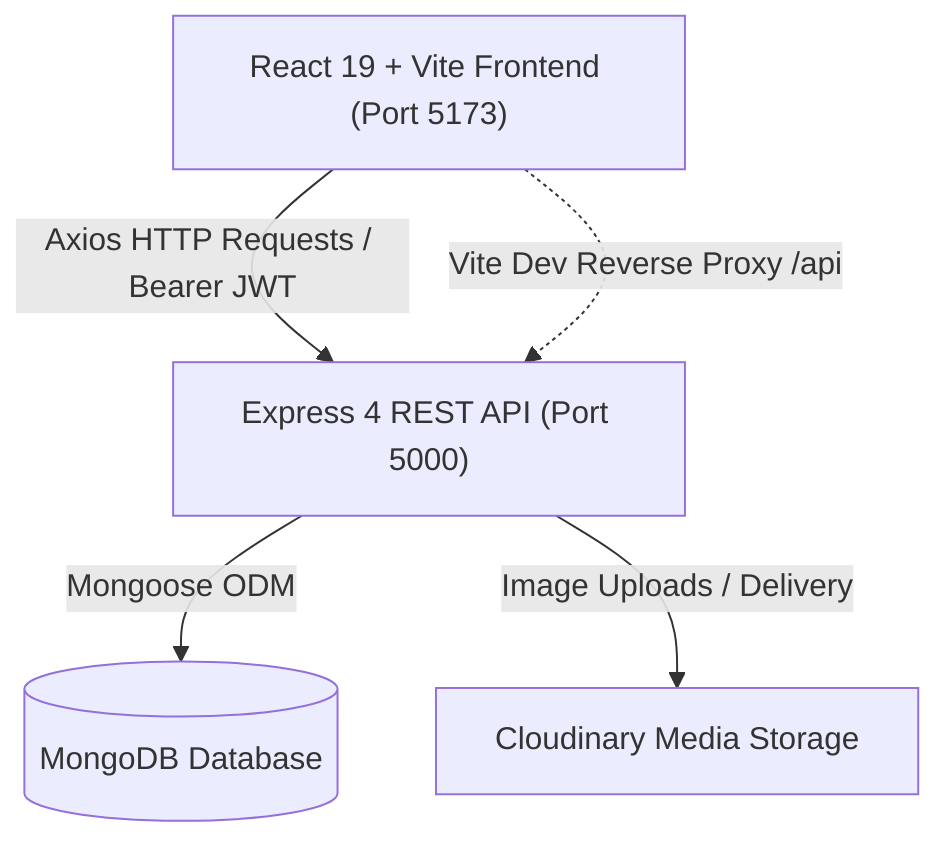
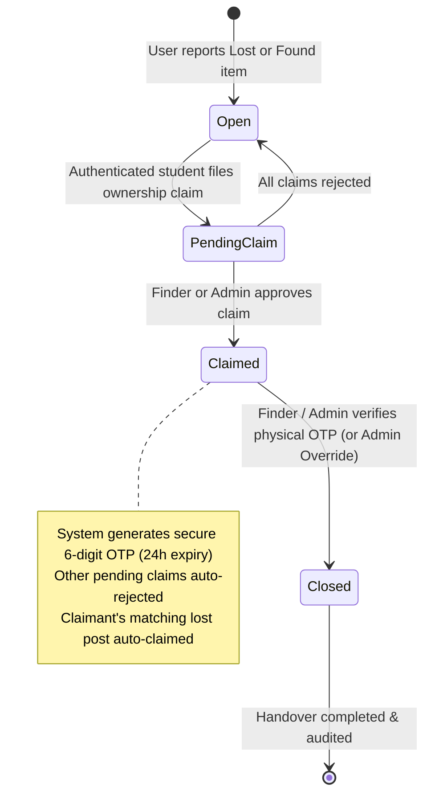

# 🔍 Found It — Campus Lost & Found Recovery Platform

[](https://react.dev/)
[](https://vitejs.dev/)
[](https://nodejs.org/)
[](https://expressjs.com/)
[](https://www.mongodb.com/)
[](https://tailwindcss.com/)
[](LICENSE)

> A modern, full-stack, secure platform designed for universities and campus facilities to streamline item recovery, dispute settlement, and physical handovers with cryptographic OTP verification.

---

## 📑 Table of Contents

- [Overview](#-overview)
- [Key Features](#-key-features)
- [System Architecture](#-system-architecture)
- [Item & Claim State Machine](#-item--claim-state-machine)
- [Tech Stack](#-tech-stack)
- [Directory Structure](#-directory-structure)
- [Getting Started](#-getting-started)
  - [Prerequisites](#prerequisites)
  - [Installation](#installation)
  - [Environment Configuration](#environment-configuration)
  - [Database Seeding](#database-seeding)
  - [Running the Application](#running-the-application)
- [Default Demo Credentials](#-default-demo-credentials)
- [API Reference](#-api-reference)
- [Automated Testing & Security Verification](#-automated-testing--security-verification)
- [Security & Privacy Engineering](#-security--privacy-engineering)
- [Deployment Guide](#-deployment-guide)
- [License](#-license)

---

## 🌟 Overview

Managing lost property on busy college campuses is historically fraught with chaos: scattered social media posts, crowded security offices, lost paper ledgers, and identity disputes during claim handovers.

**Found It** modernizes campus property management with a high-integrity, automated workflow. It pairs a dynamic React 19 frontend with a hardened Express & MongoDB API, enabling:
- Real-time cataloging of lost and found belongings.
- Heuristic cross-matching algorithms that automatically connect seekers with finders.
- Secure, two-factor physical handovers using dynamic 6-digit one-time passcodes (OTP).
- Dedicated administrative oversight for campus security desks and holding offices.

---

## ✨ Key Features

### 🎓 For Students & Campus Community
- **Dual Reporting System**: Quickly report items as either **Lost** (seeking recovery) or **Found** (custodial holding) with photos, location tags, date stamps, and category metadata.
- **Intelligent Match Recommendations**: Integrated similarity matching scores potential matches up to 100% based on category congruence, location tokens, description keyword overlap, and incident date proximity.
- **Ownership Claim Submission**: File structured claims with proof details (distinguishing marks, serial numbers, receipts).
- **Claimant OTP Handover Code**: Once an ownership claim is verified and approved, a time-limited 6-digit handover OTP is provided exclusively to the claimant.
- **Personal Activity Portals**:
  - `My Reports`: Track personal lost and found posts, view incoming claims from other students, and verify handovers.
  - `My Claims`: Monitor submitted claim statuses (`pending`, `approved`, `rejected`) and retrieve active handover OTPs.

### 🛡️ For Campus Administrators & Security Staff
- **Centralized Metrics & Analytics**: Real-time counters of active lost/found items, unresolved disputes, and completed handovers.
- **Item Moderation**: Comprehensive filtering across all listings, with capabilities to edit status, close, or remove non-compliant reports.
- **Dispute Resolution Pipeline**: Review submitted claim evidence and approve or reject claims with automated cascading updates.
- **Administrative Handover Override**: Facilitate manual property handovers for physical security holding desks when claimants are unable to generate OTPs.
- **User Directory**: View registered campus accounts, student IDs, and activity histories.

---

## 🏗️ System Architecture

Found It is structured as an organized monorepo containing a decoupled client and server:



---

## 🔄 Item & Claim State Machine

The recovery lifecycle guarantees end-to-end auditability and prevents double-claiming or unauthorized collection:



---

## 🛠️ Tech Stack

### Frontend ([`client/`](file:///c:/Users/chama/OneDrive/Desktop/Found%20It/client))
- **Core**: [React 19](https://react.dev/) & [Vite 6](https://vitejs.dev/)
- **Routing**: [React Router DOM v7](https://reactrouter.com/)
- **Styling**: [Tailwind CSS v4](https://tailwindcss.com/)
- **Icons**: [Lucide React](https://lucide.dev/)
- **Networking**: [Axios](https://axios-http.com/) with centralized auth interceptors
- **Linting**: [Oxlint](https://oxc.rs/)

### Backend ([`server/`](file:///c:/Users/chama/OneDrive/Desktop/Found%20It/server))
- **Runtime**: [Node.js](https://nodejs.org/) (ES Modules & CommonJS compatibility)
- **Web Framework**: [Express 4](https://expressjs.com/)
- **Database & ODM**: [MongoDB](https://www.mongodb.com/) via [Mongoose 8](https://mongoosejs.com/)
- **Security & Headers**: [Helmet](https://helmetjs.github.io/), [CORS](https://github.com/expressjs/cors), and [Express Rate Limit](https://github.com/express-rate-limit/express-rate-limit)
- **Authentication**: [JSON Web Tokens (jsonwebtoken)](https://jwt.io/) & [bcryptjs](https://github.com/dcodeIO/bcrypt.js)
- **Media Upload**: [Multer](https://github.com/expressjs/multer) & [Cloudinary SDK](https://cloudinary.com/)
- **Testing**: Native Fetch Test Suite & [MongoDB Memory Server](https://github.com/nodkz/mongodb-memory-server)

---

## 📂 Directory Structure

```text
Found It/
├── package.json                   # Root orchestrator (concurrent dev runners)
├── client/                        # React 19 single-page application
│   ├── public/                    # Static public assets
│   ├── src/
│   │   ├── components/            # Reusable UI components
│   │   │   ├── AuthModal.jsx      # Login and Registration dialog
│   │   │   ├── ItemCard.jsx       # Grid card for lost/found items
│   │   │   ├── ItemDetailModal.jsx# Item inspector, match viewer & OTP input
│   │   │   ├── Navbar.jsx         # Primary navigation & profile bar
│   │   │   ├── ProtectedRoute.jsx # RBAC route guard (user / admin)
│   │   │   ├── ReportModal.jsx    # Item reporting wizard
│   │   │   └── StatsBanner.jsx    # Real-time counter metrics
│   │   ├── context/
│   │   │   └── AuthContext.jsx    # Auth state & session persistence
│   │   ├── pages/                 # Route views
│   │   │   ├── AdminClaims.jsx    # Admin claims review table
│   │   │   ├── AdminDashboard.jsx # Admin analytics overview
│   │   │   ├── AdminItems.jsx     # Admin item inventory & moderation
│   │   │   ├── AdminUsers.jsx     # Campus user management
│   │   │   ├── MyClaims.jsx       # Claimant tracker & OTP viewer
│   │   │   ├── MyReports.jsx      # Finder / Seeker item management
│   │   │   └── UserDashboard.jsx  # Main discovery feed with search & filters
│   │   ├── services/
│   │   │   └── api.js             # Centralized Axios API client
│   │   ├── App.jsx                # Route declarations & modal registry
│   │   ├── index.css              # Tailwind CSS styles
│   │   └── main.jsx               # Application entrypoint
│   ├── package.json
│   ├── vercel.json                # Single-page app routing for Vercel
│   └── vite.config.js             # Vite config with backend API proxy
└── server/                        # Express backend API
    ├── src/
    │   ├── config/
    │   │   ├── cloudinary.js      # Cloudinary media configuration
    │   │   └── db.js              # MongoDB Mongoose connection
    │   ├── controllers/
    │   │   ├── adminController.js # Admin statistics, users, items & claims
    │   │   ├── authController.js  # Registration, login & profile lookup
    │   │   ├── claimController.js # Claimant queries
    │   │   └── itemController.js  # CRUD, matchmaking & OTP verification
    │   ├── middlewares/
    │   │   ├── adminMiddleware.js # Restricts access to admin role
    │   │   ├── authMiddleware.js  # JWT validation & optional auth
    │   │   └── validators.js      # Express-validator input sanitizers
    │   ├── models/
    │   │   ├── Claim.js           # Claims schema & handover metadata
    │   │   ├── Item.js            # Lost/Found item schema & search indexes
    │   │   └── User.js            # User accounts, student IDs & password hashing
    │   ├── routes/
    │   │   ├── adminRoutes.js     # /api/admin/*
    │   │   ├── authRoutes.js      # /api/auth/*
    │   │   ├── claimRoutes.js     # /api/claims/*
    │   │   └── itemRoutes.js      # /api/items/*
    │   ├── seeds/
    │   │   └── seed.js            # Database reset & default user seeder
    │   ├── tests/
    │   │   ├── test_complete_lost_found_workflow.js # 26-step E2E verification
    │   │   └── test_flow.js       # Core specification test suite
    │   ├── utils/                 # Pagination, errors, and helpers
    │   ├── app.js                 # Express server configuration & middleware
    │   └── server.js              # HTTP server bootstrapper
    ├── .env.example               # Backend environment variable template
    └── package.json
```

---

## 🚀 Getting Started

### Prerequisites

Ensure you have installed:
- [Node.js](https://nodejs.org/) `>= 18.0.0`
- [npm](https://www.npmjs.com/) `>= 9.0.0`
- [MongoDB](https://www.mongodb.com/try/download/community) running locally on port `27017` or a [MongoDB Atlas](https://www.mongodb.com/atlas) connection URI.

---

### Installation

Clone the repository and install dependencies for both the frontend and backend using the root setup command:

```bash
# Clone the repository
git clone https://github.com/chamathkar/Found-it.git
cd "Found It"

# Install all root, server, and client dependencies
npm run install:all
```

Alternatively, install dependencies manually:

```bash
npm install
npm --prefix server install
npm --prefix client install
```

---

### Environment Configuration

#### 1. Backend Configuration ([`server/.env`](file:///c:/Users/chama/OneDrive/Desktop/Found%20It/server/.env.example))
Create a `.env` file inside the `server/` directory (you can copy [`.env.example`](file:///c:/Users/chama/OneDrive/Desktop/Found%20It/server/.env.example)):

```bash
cp server/.env.example server/.env
```

Populate the configuration variables:

```env
PORT=5000
MONGODB_URI=mongodb://127.0.0.1:27017/campusrecover
JWT_SECRET=campusrecover_super_secret_jwt_key_2026
JWT_EXPIRES_IN=7d
CLIENT_URL=http://localhost:5173
NODE_ENV=development

# Optional: Cloudinary credentials for cloud image uploads
CLOUDINARY_CLOUD_NAME=
CLOUDINARY_API_KEY=
CLOUDINARY_API_SECRET=
```

#### 2. Frontend Configuration (`client/.env`)
The Vite client is preconfigured to proxy `/api` requests directly to `http://localhost:5000` during local development. For production deployments, specify the remote API URL:

```env
VITE_API_URL=http://localhost:5000
```

---

### Database Seeding

Populate the database with clean accounts (Admin and Student) to test the platform immediately:

```bash
npm run seed
```

> **Note**: Seeding is guarded against production execution (`NODE_ENV === 'production'`) to prevent accidental data loss.

---

### Running the Application

You can launch both the frontend and backend simultaneously using the root development script:

```bash
npm run dev
```

This starts:
- 🌐 **Client**: `http://localhost:5173`
- ⚙️ **Server**: `http://localhost:5000`

#### Running Independently:
```bash
# Backend only (runs node --watch on server/src)
npm run dev:server

# Frontend only (starts Vite dev server)
npm run dev:client
```

---

## 🔑 Default Demo Credentials

When running `npm run seed`, the database is provisioned with these ready-to-use accounts:

| Role | Email Address | Password | Student / Staff ID | Permissions |
| :--- | :--- | :--- | :--- | :--- |
| **Campus Admin** | `admin@college.com` | `AdminPassword123!` | `ADM-2026` | Full system access, claims review, item moderation, user audit |
| **Student (Demo)** | `sarah.j@college.com` | `Password123!` | `STU-8821` | Report items, submit claims, view match scores, handover OTP |

---

## 📡 API Reference

All backend endpoints are prefixed with `/api`. Protected routes require a valid JSON Web Token sent in the HTTP header:  
`Authorization: Bearer <TOKEN>`

### 🏥 Health Check
| Method | Endpoint | Description | Auth Required |
| :--- | :--- | :--- | :--- |
| `GET` | `/api/health` | Returns server health status and timestamp | No |

### 🔐 Authentication ([`authRoutes.js`](file:///c:/Users/chama/OneDrive/Desktop/Found%20It/server/src/routes/authRoutes.js))
| Method | Endpoint | Description | Auth Required |
| :--- | :--- | :--- | :--- |
| `POST` | `/api/auth/register` | Register new user account (role defaults to `user`) | No |
| `POST` | `/api/auth/login` | Authenticate with email and password, receive JWT | No |
| `GET` | `/api/auth/me` | Fetch authenticated user profile | Yes |

### 📦 Items & Recovery ([`itemRoutes.js`](file:///c:/Users/chama/OneDrive/Desktop/Found%20It/server/src/routes/itemRoutes.js))
| Method | Endpoint | Description | Auth Required |
| :--- | :--- | :--- | :--- |
| `GET` | `/api/items` | List active items (supports `search`, `type`, `category`, `sortBy`, pagination) | No |
| `GET` | `/api/items/stats` | Retrieve public summary counts (total, lost, found, claimed) | No |
| `GET` | `/api/items/my` | List all items reported by the authenticated user | Yes |
| `GET` | `/api/items/:id` | Get item details and associated claim status | Optional |
| `POST` | `/api/items` | Submit a new lost or found item report | Yes |
| `PATCH` | `/api/items/:id/status`| Update status (`open` / `claimed`) | Yes (Owner/Admin) |
| `PATCH` | `/api/items/:id/close` | Mark claimed item as closed | Yes (Owner/Admin) |
| `DELETE`| `/api/items/:id` | Delete item report and associated claims | Yes (Owner/Admin) |
| `GET` | `/api/items/:id/matches`| Retrieve potential matches with calculated similarity scores | No |

### 🤝 Claims & Handover OTP ([`itemRoutes.js`](file:///c:/Users/chama/OneDrive/Desktop/Found%20It/server/src/routes/itemRoutes.js) / [`claimRoutes.js`](file:///c:/Users/chama/OneDrive/Desktop/Found%20It/server/src/routes/claimRoutes.js))
| Method | Endpoint | Description | Auth Required |
| :--- | :--- | :--- | :--- |
| `POST` | `/api/items/:id/claims` | Submit ownership claim with proof details | Yes (Claimant) |
| `PATCH` | `/api/items/:id/claims/:claimId` | Review claim (`approved` or `rejected`) | Yes (Owner/Admin) |
| `POST` | `/api/items/:id/handover/verify` | Verify 6-digit OTP to complete physical handover | Yes (Finder/Admin) |
| `POST` | `/api/items/:id/handover/regenerate`| Regenerate expired handover OTP | Yes (Claimant/Admin)|
| `GET` | `/api/claims/my` | List all claims submitted by the current user | Yes (Claimant) |

### 🛡️ Administration ([`adminRoutes.js`](file:///c:/Users/chama/OneDrive/Desktop/Found%20It/server/src/routes/adminRoutes.js))
| Method | Endpoint | Description | Auth Required |
| :--- | :--- | :--- | :--- |
| `GET` | `/api/admin/stats` | System-wide statistics and recent activity audits | Yes (Admin only) |
| `GET` | `/api/admin/users` | List all registered user profiles and student IDs | Yes (Admin only) |
| `GET` | `/api/admin/items` | Full inventory table with multi-filter search | Yes (Admin only) |
| `GET` | `/api/admin/claims` | Complete claims registry with proof documentation | Yes (Admin only) |
| `PATCH` | `/api/admin/claims/:claimId/approve` | Approve claim and trigger OTP generation | Yes (Admin only) |
| `PATCH` | `/api/admin/claims/:claimId/reject` | Reject invalid claim | Yes (Admin only) |
| `PATCH` | `/api/admin/items/:id/close` | Administrative handover override (bypasses OTP)| Yes (Admin only) |
| `DELETE`| `/api/admin/items/:id` | Administratively delete an item | Yes (Admin only) |

---

## 🧪 Automated Testing & Security Verification

The platform includes two extensive test suites validating functional correctness, role safety, and business logic:

```bash
# Run core specification test suite
npm run test

# Run complete 26-step two-user lost & found workflow test
npm --prefix server run test:workflow
```

### Coverage Highlights:
- **Role Escalation Defense**: Verifies registration payloads attempting to set `role: 'admin'` are strictly sanitized to `user`.
- **Claim Integrity**: Asserts users cannot file claims on their own reports and duplicate active claims are rejected.
- **OTP Privacy Isolation**: Verifies finders cannot inspect claimants' handover OTPs through API responses.
- **Brute-Force Rate Limiting**: Locks handover verification after 5 invalid OTP attempts.
- **Cascading Resolution**: Verifies that approving a claim automatically transitions claimant's matching lost item to `claimed` to keep public boards clutter-free.

---

## 🔒 Security & Privacy Engineering

- **Cryptographic OTP Generation**: Utilizes Node.js `crypto.randomInt(100000, 1000000)` ensuring unpredictable, uniform passcodes.
- **OTP Field Sanitization**: Serializers strip sensitive OTP keys from public item payloads and ensure only authorized claimants and campus administrators can view them.
- **Rate-Limited Verification**: OTP verification enforces a maximum of 5 attempts. Exceeding this limit locks the handover, requiring campus security intervention.
- **Strict Role-Based Access Control**:
  - Backend route protection checks authenticated user role (`req.user.role === 'admin'`).
  - Frontend [`ProtectedRoute.jsx`](file:///c:/Users/chama/OneDrive/Desktop/Found%20It/client/src/components/ProtectedRoute.jsx) protects administrative screens against unauthorized client-side navigation.
- **Sanitized Search Queries**: Regex special characters are escaped before executing MongoDB queries, mitigating RegExp Denial of Service (ReDoS).
- **HTTP Header Hardening**: Secured via [Helmet](https://helmetjs.github.io/) to defend against cross-site scripting (XSS), clickjacking, and MIME sniffing.

---

## 🚢 Deployment Guide

### Client Deployment (Vercel)
The client includes a ready-to-use [`vercel.json`](file:///c:/Users/chama/OneDrive/Desktop/Found%20It/client/vercel.json) rewrite rule:
1. Connect your repository to [Vercel](https://vercel.com/).
2. Set Root Directory to `client`.
3. Add Environment Variable:
   - `VITE_API_URL`: `https://your-backend-api.onrender.com`
4. Deploy!

### Backend Deployment (Render / Railway / VPS)
1. Set Root Directory to `server`.
2. Configure Build Command: `npm install`
3. Configure Start Command: `npm start`
4. Set Environment Variables:
   - `NODE_ENV`: `production`
   - `PORT`: `5000`
   - `MONGODB_URI`: `<Your MongoDB Atlas URI>`
   - `JWT_SECRET`: `<High entropy secret>`
   - `CLIENT_URL`: `https://your-vercel-domain.vercel.app`
   - `CLOUDINARY_*`: `<Your Cloudinary credentials>`

---

## 📄 License

This project is open-source and licensed under the [MIT License](LICENSE).
